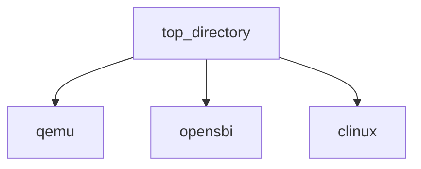

# cLinux
An experimental componentized Linux Kernel.
My goal is to build different types of OS based on component lib.

Now most of the components are extracted from Linux Kernel
and organized into a component lib.
In future, I plan to introduce components from other OS kernel.

Components can be written in C or Rust.

🚧 Working In Progress.

### Build & Run
##### Run environment
Put qemu & opensbi at the same level with clinux.

##### OpenSBI
```sh
git clone https://github.com/riscv/opensbi.git --depth 1
make PLATFORM=generic CROSS_COMPILE=riscv64-linux-gnu- PLATFORM_RISCV_XLEN=64
```
##### Qemu
```sh
git clone https://git.qemu.org/git/qemu.git --depth 1
./configure --target-list=riscv64-softmmu
make
```
##### cLinux
```sh
make
make bootrd
make run
```
### Test
Now there're three profiles
```sh
$ make profiles
Bootrd filename: ./output/bootrd.disk

Bootrd profiles: total[4]:
Bootrd profiles: offset(3a11d0) curr[3a11d0]:
  -> [0]: hello_world[3a11d0]
     [1]: arceos_hello[3a1208]
     [2]: memory_addr[3a1268]
     [3]: linux[3a12a8]
```
In default, this is a Unikernel-style OS (Components from ArceOS).
We can change the profile
```sh
$ tools/ch_bootrd/ch_bootrd ./output/bootrd.disk -s 3
Bootrd filename: ./output/bootrd.disk

Bootrd profiles: total[4]:
Bootrd profiles: offset(3a11d0) curr[3a11d0]:
     [0]: hello_world[3a11d0]
     [1]: arceos_hello[3a1208]
     [2]: memory_addr[3a1268]
  -> [3]: linux[3a12a8]
```
And then, run again
```sh
$ ./scripts/qemu.sh

[...]

do_read_fault: addr(51000) pgoff(41) flags(254)
page_add_file_rmap: NOT implemented!
alloc_set_pte: addr(51000) entry(200D8C5B)
_ksys_write: 1 fd(1)
_ksys_write: 2
serial8250_tx_chars: send count(16) ...
[Hello, world!]
vfs_write: ret(17)
--- --- _do_page_fault: cause(D) addr(78200)
--- handle_pte_fault: vmf: addr(78000) flags(254) pgoff(78)
do_anonymous_page: addr(78000) pgoff(78) flags(254)
--- --- _do_page_fault: cause(F) addr(781F8)
--- handle_pte_fault: vmf: addr(78000) flags(255) pgoff(78)
--- wp_page_copy: 1.2
--- wp_page_copy: 3
_do_group_exit: ...

########################
PANIC: do_exit (sys/exit.c:12)
NOW user-space app exit! [0]
########################
cloud@server:~/gitStudy/clinux$
```
Now this is a Linux-kernel-like OS from boot to first user-process(init).
For experiment, this user-process init just prints [Hello, wolrd!] and exit.
> Note: `Profile [1]: arceos_hello[3a1208]` can't be selected now.
> We need to introduce ArceOS's objs first as below:
### Import components from ArceOS and Test
Patch and script are in directory `thirty_part/arceos/`.
Copy both these files into the top directory of arceos first.
1. Patch arceos
    At the top directory of arceos, execute `git apply prepare_export_obj.patch`
2. Export objs from arceos to clinux
    At the top directory of arceos, execute `./export_objs.sh`
3. Return to clinux, make && make run

Temporarily pause!
